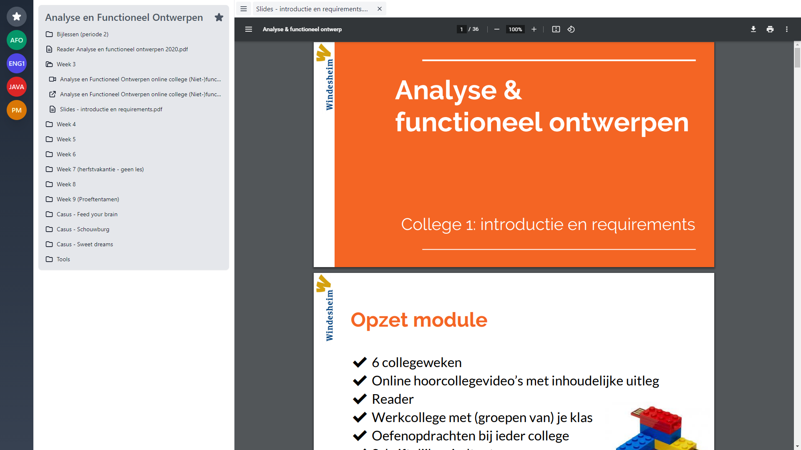

# ELO
Dit is een alternatief voor de standaard Windesheim ELO leeromgeving 
Om dit modelijk te maken is een userscript gebruikt. 
Een userscript is een javascipt bestand wat een bestaande site kan wijzigen. 
Dit userscript herschrijft de gehele windesheim ELO.
  

## Voordelen van deze ELO:
* sneller
* moderner
* open-source
  

## Installeren: 
Om deze ELO te kunnen gebruiken moet je eerst Tampermonkey geïnstalleerd hebben.
Hierna kan je het userscript installeren.
1. Tampermonkey: https://www.tampermonkey.net/
1. Het userscript: https://github.com/Mart-0/ELO/raw/master/elo.user.js
  

## Gemaakt met:
* vue
* tailwindcss
* heroicons
  

## Screenshots van de ELO na installatie:
Dit is wat je ziet aan het begin:

Nadat je een vak gekozen hebt kun je de inhoud van het vak bekijken:

Een gekozen item opent naast de inhoud van het vak:
